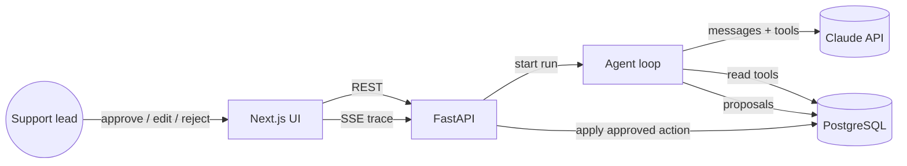

# Support Triage Agent

A tool-using LLM agent that works a support inbox. For every ticket it investigates on
its own (customer, plan, charges, help center, similar tickets) and proposes a triage, a
reply grounded in help-center articles, a refund, or an escalation. **Nothing changes
until a human approves it.**

Python and FastAPI on the backend, Next.js and TypeScript on the frontend, PostgreSQL.
The model layer is provider-agnostic: Claude through the official `anthropic` SDK, or
Gemini through its OpenAI-compatible API (the public demo runs on Gemini's free tier).
The company, customers and tickets are fictional.

Live demo: https://support-triage-agent-tau.vercel.app

## What it shows

- **An agent, not a chatbot.** The model decides which tools to call and in what
  order. The loop is hand-written so every step can be limited, persisted and streamed.
- **Guardrails that live in code, not in the prompt.** Turn limit, token budget, wall
  clock timeout, refusal and truncation handling. Hitting any of them escalates to a
  human automatically instead of failing silently.
- **Write actions are proposals.** Tools like `propose_refund` validate against real
  data (order owner, refundable balance, refund cap) and store a pending proposal. Money
  moves only in the approve endpoint, inside a row lock.
- **Prompt-injection resistance by design.** Ticket text is escaped and passed as data
  inside `<ticket>` tags. Even if the model were convinced, no tool can execute an
  irreversible action. A seeded ticket tries exactly this.
- **Observable runs.** Every model turn and tool call is a row in `agent_steps` with
  input, output, duration and errors. Tokens and cost are tracked per run. The UI
  streams the trace live over Server-Sent Events.
- **Tested without a network.** The model sits behind a small `AgentModel` protocol;
  tests use a scripted fake that replays tool-call sequences.
- **Document processing.** PDF attachments are uploaded through the API, their text is
  extracted with `pypdf`, and the agent's `read_attachments` tool turns them into typed
  fields (type, issuer, number, date, currency, total, line items) through a forced tool
  call validated by Pydantic, with one corrective retry. A seeded invoice disagrees with
  the order history by 40 USD; the agent has to notice.
- **Evaluations.** `python -m app.evals` runs the live agent over labelled tickets and
  scores each run: triage category, required escalation, refund decision and amount,
  replies citing help-center articles, no leaked account data, required tools used.
  Reports land in `backend/evals/reports/` as Markdown and JSON.
- **Provider fallback.** On Gemini, a list of models is tried in order when a daily free
  quota runs out, and per-minute limits are retried after the delay the API asks for.

## Architecture



```
backend/
  app/agent/     loop.py (the agent loop and guardrails), tools.py, model.py, prompts.py
  app/api/       tickets, runs (with SSE), actions (approve and reject)
  app/db/        SQLAlchemy 2.0 async models
  alembic/       migrations
  tests/         tools, loop, API against a real Postgres
frontend/
  app/           inbox, ticket page with live trace, new ticket form
  components/    timeline, proposal cards with inline editing
  lib/           typed API client, SSE reader, pure state helpers with tests
```

### Agent loop

1. The ticket goes in as the first user message, escaped and wrapped in `<ticket>` tags.
2. Each turn the model returns text and tool calls. Independent calls run in one turn;
   all results go back in a single user message.
3. Read tools return data. Proposal tools validate and store a pending proposal.
4. The run must end with a triage plus either a reply or an escalation. If the model
   stops early it gets one corrective message, then the run is marked failed.
5. Limits are checked every turn. Breaching one records a guardrail step and an
   automatic escalation.

### Decisions and trade-offs

| Decision | Why | Next step |
| --- | --- | --- |
| Hand-written loop instead of the SDK tool runner | Per-step persistence, budgets and streaming in one place | Keep |
| Postgres full-text search for the help center | No extra embedding provider for 20 articles; ranking is good enough and explainable | pgvector plus hybrid ranking |
| Runs execute as in-process background tasks | Simplest thing that works on one instance | A queue (Redis or Postgres `SKIP LOCKED`) for multiple workers |
| SSE by polling the database every 500 ms | Works across processes and survives reconnects | Postgres `LISTEN/NOTIFY` |
| Public demo without auth | Recruiters can try it with one click | Rate limit per IP and a daily spend cap stand in for auth |

## Running locally

Backend (Python 3.12+ and a Postgres you can reach):

```bash
cd backend
python -m venv .venv
.venv/Scripts/pip install -e ".[dev]"      # .venv/bin/pip on macOS and Linux
cp .env.example .env                         # set DATABASE_URL and ANTHROPIC_API_KEY
.venv/Scripts/alembic upgrade head
.venv/Scripts/python -m app.seed
.venv/Scripts/uvicorn app.main:app --reload
```

Frontend:

```bash
cd frontend
npm install
NEXT_PUBLIC_API_URL=http://localhost:8000 npm run dev
```

Pre-run the agent on every seeded ticket so the inbox is not empty:

```bash
cd backend
.venv/Scripts/python -m app.prerun
```

## Tests and checks

```bash
cd backend
TEST_DATABASE_URL=postgresql+asyncpg://user@host/db_test .venv/Scripts/pytest
.venv/Scripts/ruff check . && .venv/Scripts/mypy app

cd frontend
npm run lint && npm run typecheck && npm test && npm run build
```

CI runs all of it on every push, with Postgres as a service container.

## Deploy

- Backend: Render web service from `render.yaml` (Docker). Migrations and the seed run
  on start.
- Database: Neon Postgres. The settings accept Neon's connection string as is.
- Frontend: Vercel with `NEXT_PUBLIC_API_URL` pointing at the Render service.

## Configuration

| Variable | Default | Meaning |
| --- | --- | --- |
| `ANTHROPIC_API_KEY` | | API key for Claude |
| `AGENT_MODEL` | `claude-opus-5-5` | Model id |
| `AGENT_EFFORT` | `medium` | Effort level |
| `AGENT_MAX_TURNS` | `8` | Model turns per run |
| `AGENT_MAX_TOTAL_TOKENS` | `120000` | Token budget per run |
| `AGENT_TIMEOUT_SECONDS` | `90` | Wall-clock limit per run |
| `REFUND_CAP` | `2000` | Largest refund the agent may propose |
| `DAILY_SPEND_CAP_USD` | `5` | New runs are refused after this daily spend |
| `RUNS_PER_IP_PER_HOUR` | `10` | Rate limit for the public demo |
